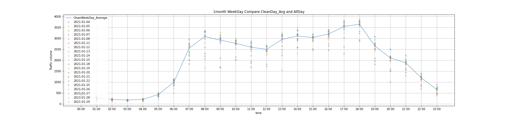
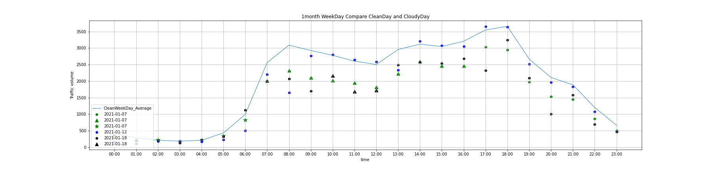
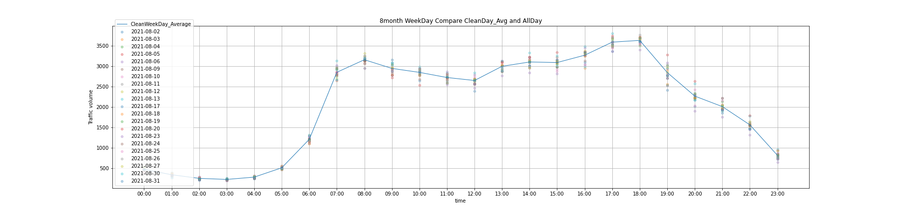
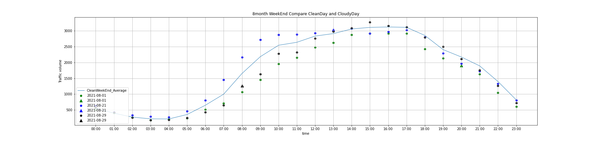
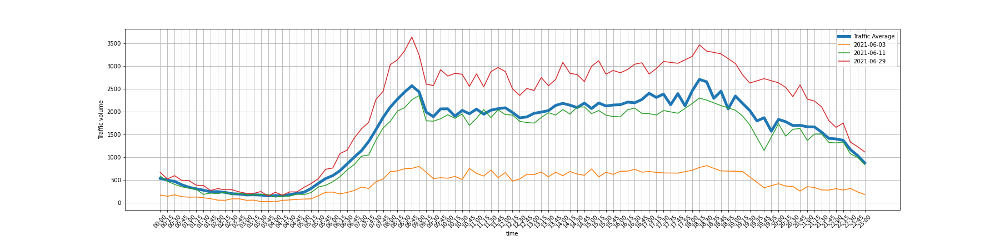
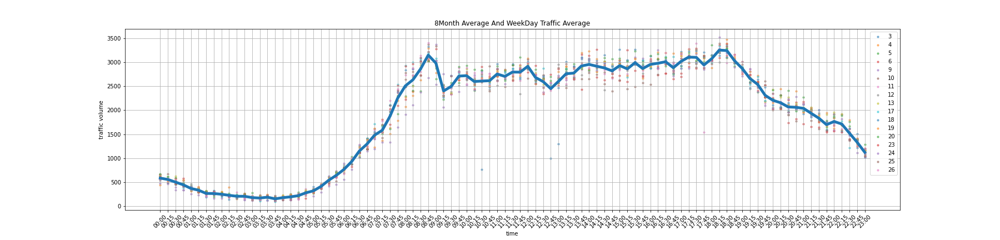

# VDS_WeatherData_Visualization.
- 각 지 자체의 VDS 데이터 포맷이 달라 전처리 과정이 다름.
- 요일타입(평일, 주말, 국경일) ,날씨(강수량,적설량)에 따른 교통량 비교 시각화

#### 1. VDS 데이터 

- 대전시에서 제공하는 VDS 데이터
- 청주시에서 제공하는 VDS 데이터

#### 2. 날씨 데이터

- OpenWeather API 이용

#### 3. 그래프

- 교통량, 점유율, 평균속도 비교 가능
- 대표적인 예시 그래프만 출력

##### 3-1)  대전 한밭대로 교통량 비교 (요일은 평일, 주말, 국경일로 나눠진다.)

- 1월 맑은날 평균 교통량 대비 적설량에 따른 교통량 비교 (평일)

- 흐린날 기준 : (강수량 >= 0.1 & 적설량 > 1)

  

- 그래프 모양에 따라 적설량 차이가 상이함.
- 동그라미 : 적설량 >= 0 & 적설량 < 4
- 세모 : 적설량 >= 4 & 적설량 < 7
- 별 : 적설량 >= 7

- 8월 맑은날 평균 교통량 대비 적설량에 따른 교통량 비교 (평일)
- 흐린날 기준 : 강수량 >= 10

- 그래프 모양에 따라 강수량 차이가 상이함.
- 동그라미 : 강수량 >= 0 & 강수량 < 10
- 세모 : 강수량 >= 10 & 강수량 < 20
- 별 : 강수량 >= 20

##### 3-2) 청주시 상당사거리 교통량 비교

- 6월 교통량 평균 대비 비오는날 교통량 비교

- 8월 교통량 평균 대비 평일 모든 날 교통량 비교

